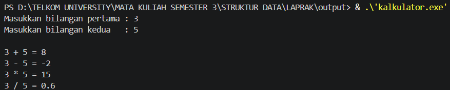
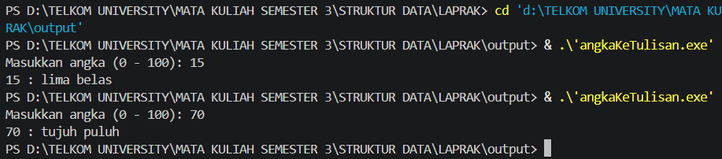
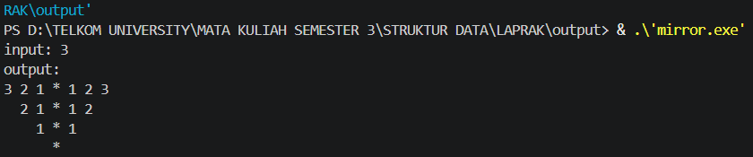

# <h1 align="center">Laporan Praktikum Modul 1 - Codeblocks IDE & Pengenalan Bahas C++ (Bagian Pertama)</h1>
<p align="center">Andhika Nur Pratama - 109082500056</p>

## Dasar Teori
Berdasarkan modul praktikum Struktur Data: Code Blocks IDE & Pengenalan Bahasa C++ (Bagian Pertama), praktikum ini membahas pengenalan Code Blocks sebagai IDE berbasis open-source beserta cara kompilasinya seperti build, run, dan clean. Selain itu, dibahas pula struktur dasar program C++, penggunaan identifier, tipe data, variabel, konstanta, fungsi input/output (cout, cin, getchar), berbagai operator, percabangan (if, if-else, switch), perulangan (for, while, do-while), hingga tipe data struktur (struct).
contoh :
Linked list atau yang disebut juga senarai berantai adalah Salah satu bentuk struktur data yang berisi kumpulan data yang tersusun secara sekuensial, saling bersambungan, dinamis, dan terbatas[1]. Linked list terdiri dari sejumlah node atau simpul yang dihubungkan secara linier dengan bantuan pointer.

## Unguided 

### 1. (Buatlah program yang menerima input-an dua buah bilangan betipe float, kemudian memberikan output-an hasil penjumlahan, pengurangan, perkalian, dan pembagian dari dua bilangan tersebut.)

```C++
#include <iostream>
using namespace std;

int main() {
    float a, b;

    cout << "Masukkan bilangan pertama : ";
    cin >> a;
    cout << "Masukkan bilangan kedua   : ";
    cin >> b;

    cout << endl;
    cout << a << " + " << b << " = " << a + b << endl;
    cout << a << " - " << b << " = " << a - b << endl;
    cout << a << " * " << b << " = " << a * b << endl;

    if (b != 0)
        cout << a << " / " << b << " = " << a / b << endl;
    else
        cout << "Pembagian tidak bisa dilakukan (pembagi = 0)" << endl;

    return 0;
}
```
### Output Unguided 1 :

##### Output 1

contoh :


penjelasan unguided 1
Program membaca dua bilangan float, lalu mencetak hasil tambah, kurang, kali, dan bagi. Sebelum membagi, dicek dulu b != 0 supaya tidak terjadi pembagian dengan nol.Program membaca dua bilangan float, lalu mencetak hasil tambah, kurang, kali, dan bagi. Sebelum membagi, dicek dulu b != 0 supaya tidak terjadi pembagian dengan nol.

### 2. (Buatlah sebuah program yang menerima masukan angka dan mengeluarkan output nilai angka tersebut dalam bentuk tulisan. Angka yang akan di-input-kan user adalah bilangan bulat positif mulai dari 0 s.d 100)

```C++
#include <iostream>
using namespace std;

int main() {
    string satuan[10] = {"nol", "satu", "dua", "tiga", "empat",
                        "lima", "enam", "tujuh", "delapan", "sembilan"};
    int n;

    cout << "Masukkan angka (0 - 100): ";
    cin >> n;

    cout << n << " : ";

    if (n < 0 || n > 100) {
        cout << "angka di luar jangkauan" << endl;
    } else if (n < 10) {
        cout << satuan[n];
    } else if (n == 10) {
        cout << "sepuluh";
    } else if (n == 11) {
        cout << "sebelas";
    } else if (n < 20) {
        cout << satuan[n % 10] << " belas";
    } else if (n < 100) {
        cout << satuan[n / 10] << " puluh";
        if (n % 10 != 0)
            cout << " " << satuan[n % 10];
    } else {
        cout << "seratus";
    }
    cout << endl;

    return 0;
}
```
### Output Unguided 2 :

##### Output 1


contoh :


penjelasan unguided 2
Angka dipecah per rentang 0-9 diambil dari array satuan[], 10 dan 11 ditulis khusus ("sepuluh", "sebelas"), 12-19 memakai "belas", 20-99 memakai n / 10 untuk puluhan dan n % 10 untuk satuan, dan 100 jadi "seratus".

### 3. (Buatlah program yang dapat memberikan input dan output sbb.)

```C++
#include <iostream>
using namespace std;

int main() {
    int n;

    cout << "input: ";
    cin >> n;
    cout << "output:" << endl;

    for (int k = n; k >= 0; k--) {
        for (int s = 0; s < (n - k) * 2; s++)
            cout << " ";

        for (int i = k; i >= 1; i--)
            cout << i << " ";

        cout << "*";

        for (int i = 1; i <= k; i++)
            cout << " " << i;

        cout << endl;
    }

    return 0;
}
```
### Output Unguided 3 :

##### Output 1


contoh :


##### Output 2
/(nama repository github kalian)/blob/main/(path folder menyimpan screenshot output)/(nama file screenshot output).png)

penjelasan unguided 3
Satu loop mengatur baris (k turun dari n ke 0), dan tiap baris mencetak spasi, angka turun, tanda *, lalu angka naik. Spasi bertambah 2 di tiap baris, jadi bentuknya menyempit ke bawah.

## Kesimpulan
Modul 1 praktikum Struktur Data ini membahas dasar-dasar penggunaan *Integrated Development Environment* (IDE) Code::Blocks serta pengenalan bahasa pemrograman C++ yang mencakup struktur dasar program, penggunaan tipe data, variabel, konstanta, operator aritmatika, logika, hingga *input/output*. Selain itu, modul ini juga mempelajari penerapan fungsi kondisional (*if*, *if-else*, *switch*), perulangan (*for*, *while*, *do-while*), tipe data bentukan (*struct*), serta modularisasi program menggunakan fungsi untuk menyelesaikan berbagai studi kasus pemrograman dasar.

## Referensi
[1] Triase. (2020). Diktat Edisi Revisi : STRUKTUR DATA. Medan: UNIVERSTAS ISLAM NEGERI SUMATERA UTARA MEDAN. 
<br>[2] Indahyati, Uce., Rahmawati Yunianita. (2020). "BUKU AJAR ALGORITMA DAN PEMROGRAMAN DALAM BAHASA C++". Sidoarjo: Umsida Press. Diakses pada 10 Maret 2024 melalui https://doi.org/10.21070/2020/978-623-6833-67-4.
<br>...
